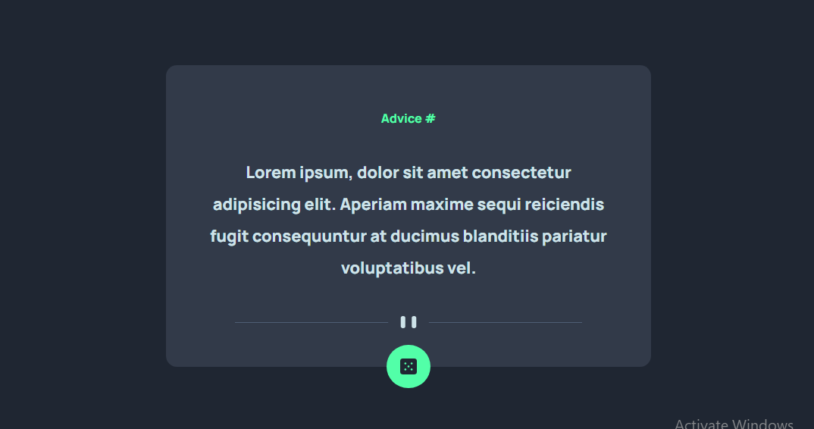

# Frontend Mentor - Advice generator app solution

This is a solution to the [Advice generator app challenge on Frontend Mentor](https://www.frontendmentor.io/challenges/advice-generator-app-QdUG-13db). Frontend Mentor challenges help you improve your coding skills by building realistic projects.

## Table of contents

- [Overview](#overview)
- [The challenge](#the-challenge)
- [Screenshot](#screenshot)
- [Links](#links)
- [My process](#my-process)
- [Built with](#built-with)
- [What I learned](#what-i-learned)
- [Useful resources](#useful-resources)
- [Author](#author)
- [Acknowledgments](#acknowledgments)

## Overview

You're welcome, this is my solution to the Frontend Mentor Advice generator app challenge. Hope you like it.

### The challenge

Users should be able to:

- View the optimal layout for the app depending on their device's screen size
- See hover states for all interactive elements on the page
- Generate a new piece of advice by clicking the dice icon

### Screenshot

### Links

- Solution URL: [Advice-Api-App](https://advice-api-app.netlify.app/)

## My Process

We were already provided a UI guide by Frontend Mentor, so i followed the guide and brough the API app to life using the below technologies

### Built with

- Semantic HTML5 markup
- CSS custom properties
- Flexbox
- CSS Grid
- Mobile-first workflow
- [Styled Components](https://styled-components.com/) - For styles

### What I learned

Building this app, i was able to revisit topics surrounding APIs and i found it really helpful.

### Useful resources

- [devdocs.io](https://devdocs.io/) - This helped juggle my memory when i needed a refresher.

## Author

- Website - [devChubbi](https://www.devchubbiportfolio.netlify.app)
- Frontend Mentor - [@Chubbi_Stephen](https://www.frontendmentor.io/profile/Chubbi-Stephen)
- Twitter - [@devChubbi](https://www.twitter.com/devChubbi)

## Acknowledgments

All thanks to Frontend Mentor for always being there. Thanks to my very good friend Stephen also for the consistent support.
